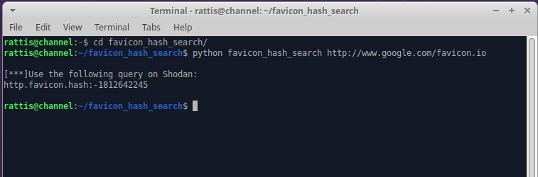

# favion_hash_search
Python script to generate the MMH3 hash for a favicon for searching online.

Takes user provided url for a Favicon and creates a MurMurHash3 hash. The output provides the search string for pasting in to Shonda.io to search for the hash.
This is a modified version of the script posted on the SANS ISC Diary (https://isc.sans.edu/diary/Hunting+phishing+websites+with+favicon+hashes/27326)


## Installation

#TODO: Right now clone repo, create a virtual environment, install requirements.

```sh
git clone https://github.com/crattis/favion_hash_search.git
cd favionc_hash_search
python -m venv .venv --propmt FHS
source .venv/bin/activate
python -m pip install -r requirements.txt
```

## Usage example
From within the python virtual environment for script (See Installation comment above)

```python
python favicon_hash_search http://www.google.com/favicon.ico
```

## Development setup


To work on development, install like it says in the installation environment above.

## Release History
* 0.0.1
    * Work in progress

## Meta

Chris J – [@rattis](https://twitter.com/rattis)

Distributed under the MIT license. See ``LICENSE`` for more information.

[https://github.com/crattis/](https://github.com/crattis/)

